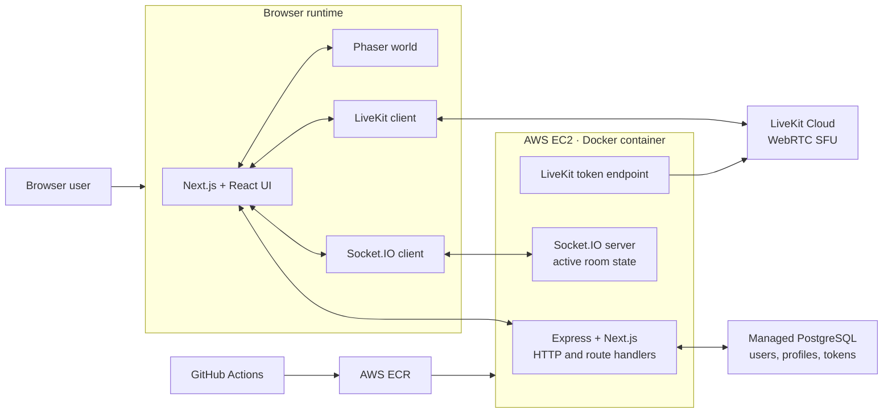

<h1 align="center">Social Square</h1>

  A real-time, game-like virtual workspace where people move through a shared 2D room, 
  meet over live audio/video, share screens, chat, and organize around team tables.

  <a href="https://socialsquare.tech"><strong>Live application</strong></a>
  ·
  <a href="https://www.youtube.com/watch?v=hMgD_D21UHY"><strong>Video demo</strong></a>
  ·
  <a href="docs/README.md"><strong>Engineering blueprint</strong></a>
  ·
  <a href="https://github.com/Haamid-syed/Social-Square"><strong>Private implementation</strong></a>

  
  
  
  
  
  
  
  

> [!IMPORTANT]
> This is the public, documentation-only repository for Social Square. It explains the product and its engineering in depth, but intentionally contains no application source code, credentials, private infrastructure identifiers, or deployable build artifacts. The implementation remains private and is not offered under an open-source license.

## Current status

**Social Square is a working, deployed MVP at [socialsquare.tech](https://socialsquare.tech).** The production application is containerized on AWS, persists account and profile data in managed PostgreSQL, and uses LiveKit Cloud for real-time media. This blueprint was reconciled with the private implementation on **15 September 2026**.

| Area | Current state |
|---|---|
| Identity | Email/password, Google OAuth, GitHub OAuth, access/refresh cookies |
| User experience | Onboarding, editable profiles, avatar uploads, account settings |
| Virtual rooms | Phaser tile map, synchronized avatars, collision-aware movement |
| Collaboration | Live audio/video, meeting grid, screen share, room chat |
| Coordination | Participant list, room-owner handoff, user roles, table-role labels |
| Durable data | Users, profiles, refresh tokens, reset tokens, and room-related schema |
| Ephemeral data | Active players, ownership, roles, table assignments, and chat |
| Delivery | GitHub Actions to AWS ECR to AWS Systems Manager to Docker on EC2 |
| Verification | Production build and type-check pass; all 10 focused automated tests pass |

The current release deliberately keeps audio and video room-wide. Earlier dormant avatar-distance calculations were removed because no enabled feature consumed them; proximity media remains future work. See [Current state and roadmap](docs/CURRENT_STATE.md) for an exact implemented/partial/planned breakdown.

## What the product does

Social Square replaces the flat meeting grid with a navigable shared place. An authenticated user joins a room as an animated avatar, moves through a collision-aware pixel workspace, sees other participants move in real time, and opens media, chat, and coordination tools without leaving the world.

The primary user flow is:

1. Sign up with email/password or continue with Google/GitHub.
2. Complete a student or remote-worker onboarding profile.
3. Enter a room identifier from the join screen.
4. Load the Phaser world, Socket.IO session, and LiveKit session together.
5. Move with WASD/arrow keys and collaborate through audio, video, screen share, chat, and the participant panel.
6. Use team roles and four assignable table zones to organize the room.
7. Leave explicitly or disconnect; the server removes the player and hands ownership to another participant when required.

## System at a glance

One custom Node process owns the application HTTP listener. It prepares Next.js, mounts Socket.IO on the same server, exposes the LiveKit token route, and delegates remaining traffic to Next.js. Media packets do not travel through the application server; LiveKit handles that separate data plane.

## Core capabilities

### Spatial multiplayer

- 2D Tiled workspace rendered with Phaser 3 and Arcade Physics.
- WASD/arrow-key movement, directional animation, collisions, camera follow, pixel rendering, responsive resize, and adaptive zoom.
- Authenticated Socket.IO synchronization for joining, movement, disconnection, ownership, roles, and table assignments.
- Movement snapshots capped at 20 Hz while local and remote avatars render at display frame rate; remote positions are interpolated between snapshots.
- Four table zones whose labels can be assigned by the room owner; matching participants receive an in-world welcome state.

### Live collaboration

- LiveKit audio/video rooms with local publishing, automatic remote subscription, adaptive streaming, dynacast, and reconnect handling.
- Microphone, camera, and screen-share controls with a responsive meeting grid.
- A floating local-camera bubble that tracks the local avatar while the meeting panel is closed.
- Room chat with a 300-message browser cap, join/leave notices, event-driven participant media state, and owner-controlled coordination roles.

### Accounts and profiles

- Password authentication with validation and bcrypt hashing.
- Google and GitHub OAuth authorization-code flows with state validation.
- Short-lived access tokens and database-backed refresh tokens in HTTP-only cookies.
- Student/remote-worker onboarding, profile editing, avatar upload, password change, and password-reset token flow.
- Protected application routes and an onboarding guard.
- Authenticated Socket.IO handshakes and LiveKit token issuance bound to the signed-in application identity.

## Verification and measured performance

The current focused verification suite passes:

| Check | Result |
|---|---|
| `npm run typecheck` | Pass |
| `npm test` | 10 passed, 0 failed, 0 skipped |
| `npm run build` | Pass with Next.js 16.2.3; 27 routes/pages generated or registered |
| Docker server TypeScript compilation | Pass in a temporary output directory |

The 10 tests cover movement throttling and interpolation, LiveKit authorization, Socket.IO authentication, room isolation, movement, chat, explicit leave, disconnect cleanup, and owner handoff.

The reproducible Socket.IO harness uses authenticated synthetic Node.js clients against the production realtime handler. In the repeated 15-client comparison, reducing movement snapshots from 60 Hz to 20 Hz reduced emitted events and recipient fan-out by **66.7%**, while median average server CPU fell from **19.7% to 10.7%** and p95 sender-to-recipient latency remained effectively flat at **1.2 ms**. The largest optimized run used **240 clients across 16 rooms**, sustained **67,207.5 recipient deliveries/second** at **1.1 ms p95**, and recorded zero missing deliveries, duplicate deliveries, or unexpected disconnects.

These are Apple M1 local-loopback Socket.IO measurements. They do not measure browser rendering, PostgreSQL, LiveKit/WebRTC, the EC2 deployment, or production capacity. See [Verification and benchmarks](docs/VERIFICATION_AND_BENCHMARKS.md) for methodology, thresholds, the baseline/optimized comparison, soak results, and the complete test list.

## Latest engineering update

The 15 September 2026 update strengthened the implementation across its main runtime boundaries:

- Build and type safety were restored for Next.js 16.2.3, with `src/proxy.ts` established as the single route-protection entry point. The production build and standalone type-check pass; the legacy `next lint` command still requires migration.
- Socket.IO connections now require the application access-token cookie. The server derives identity and room membership from verified state, validates movement and chat payloads, and restricts roles and table identifiers through allowlists.
- LiveKit token issuance now authenticates the application session, validates the room and requested username, and binds the media identity to the verified JWT identity.
- Explicit leave and disconnect use the same cleanup path, including room deletion and owner handoff. `room-state-update` is now the single initial realtime state source.
- Movement transmission is capped at 20 snapshots per second with a final stop snapshot, remote interpolation, and large-correction snapping. Chat history is bounded, participant updates are debounced, and participant counts are event-driven.
- Ten focused tests cover movement policy, LiveKit authorization, and Socket.IO authentication and lifecycle behavior. The authenticated benchmark harness records delivery integrity, latency, throughput, CPU, and memory against declared thresholds.
- Unused direct dependencies and the stale compiled server artifact were removed; Docker continues to compile the custom server during image creation.

Durable database-backed room admission, multi-instance realtime state, proximity-based media, broader API/browser testing, production-environment load testing, and deployment rollback remain future work.

## Engineering blueprint

| Document | What it answers |
|---|---|
| [Architecture](docs/ARCHITECTURE.md) | What runs where, how the major subsystems connect, and where state lives |
| [Component map](docs/COMPONENT_MAP.md) | Which important private-repository files own each responsibility and how they depend on one another |
| [Real-time protocol](docs/REALTIME_PROTOCOL.md) | Socket.IO contracts, room lifecycle, ownership, movement, chat, roles, and LiveKit separation |
| [Data, auth, and API](docs/DATA_AUTH_API.md) | Persistent models, token lifecycle, route protection, uploads, and the HTTP surface |
| [Deployment and operations](docs/DEPLOYMENT_OPERATIONS.md) | Container topology, CI/CD path, configuration boundaries, failure modes, and operational gaps |
| [Design decisions](docs/DESIGN_DECISIONS.md) | Why the project uses Socket.IO, LiveKit, Phaser, a custom server, and mixed durable/ephemeral state |
| [Verification and benchmarks](docs/VERIFICATION_AND_BENCHMARKS.md) | Test coverage, benchmark methodology, thresholds, results, limitations, and reproducibility |
| [Current state and roadmap](docs/CURRENT_STATE.md) | What is implemented, partial, modeled only, or still planned |
| [Full architecture map](docs/FULL_ARCHITECTURE_MAP.md) | Compact end-to-end reference for the entire system |

## Technology stack

| Layer | Technologies | Responsibility |
|---|---|---|
| Web application | Next.js 16 App Router, React 19, TypeScript | Pages, route handlers, layouts, and integrated room UI |
| World simulation | Phaser 3, Tiled assets, Arcade Physics | Rendering, camera, animation, movement, collisions, spatial zones |
| Real-time state | Socket.IO client/server | Presence, movement, chat, ownership, roles, table assignments |
| Media | LiveKit client/server SDK, WebRTC SFU | Audio, video, screen sharing, subscriptions, reconnects |
| Client state | Zustand | Auth/user state shared across React surfaces |
| Design system | Tailwind CSS, Radix UI, shadcn-style components, Framer Motion | Responsive, accessible interaction layer |
| Server | Node.js 20, Express 5, Next.js route handlers | Shared listener, APIs, sockets, media-token issuance |
| Data | PostgreSQL, Prisma 6 | Accounts, profiles, durable tokens, room schema |
| Security | Zod, bcryptjs, JWT via jsonwebtoken/jose | Validation, hashing, Node/Edge token verification |
| Infrastructure | Docker, GitHub Actions, AWS ECR/EC2/SSM, LiveKit Cloud | Build, registry, deployment, hosting, managed media |

## Engineering scope and authorship

Social Square was designed and implemented end-to-end by [Haamid Syed](https://github.com/Haamid-syed). The work spans product UI, multiplayer state synchronization, Phaser world behavior, Socket.IO room lifecycle, LiveKit media integration, authentication and profiles, PostgreSQL modeling, and container delivery on AWS.

Key engineering challenges included:

- reconciling browser, Phaser, Socket.IO, and LiveKit lifecycles on one room screen;
- cleaning up correctly through refreshes, explicit exits, network drops, and owner departure;
- keeping media on a scalable SFU path while spatial state uses small real-time events;
- separating durable account data from high-churn live-room data;
- deploying WebSocket and WebRTC-aware behavior behind HTTPS; and
- preserving a path from the current single-process MVP to shared state and multiple replicas.

## Boundaries and ownership

This repository is intended for portfolio review, engineering discussion, and architecture evaluation. It is not a runnable substitute for the private repository. No source license is granted by publication of these documents; see [LICENSE](LICENSE).

Read-only access to the private implementation can be considered for interview or formal evaluation purposes. Please contact the repository owner through GitHub.
