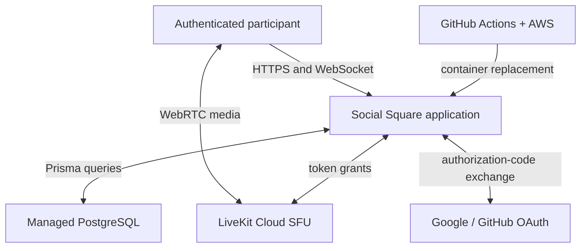
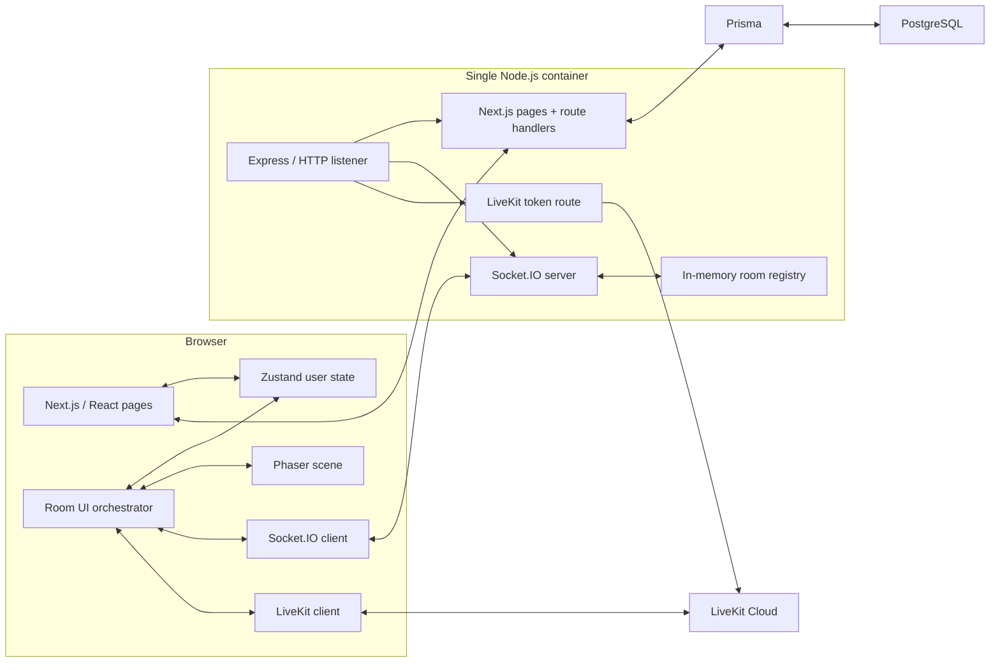
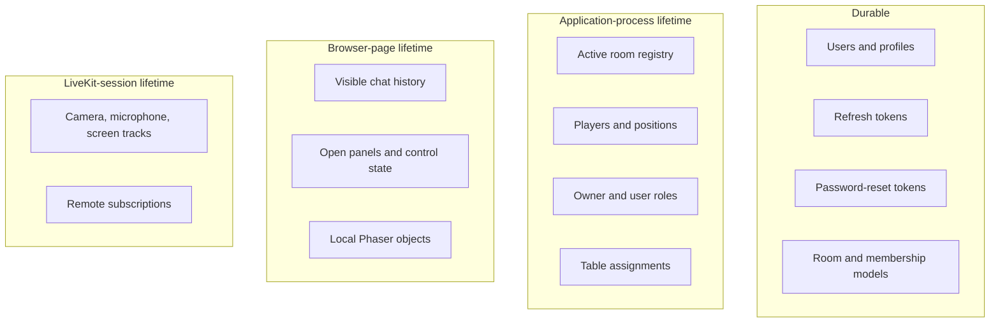
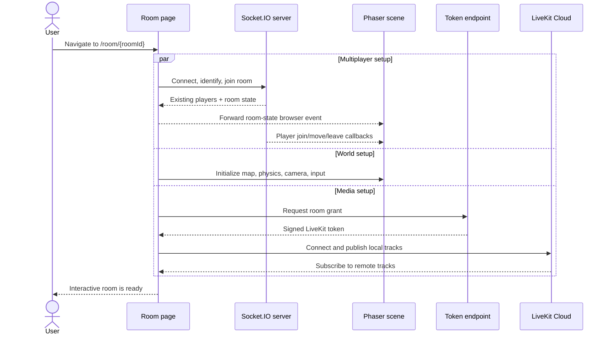
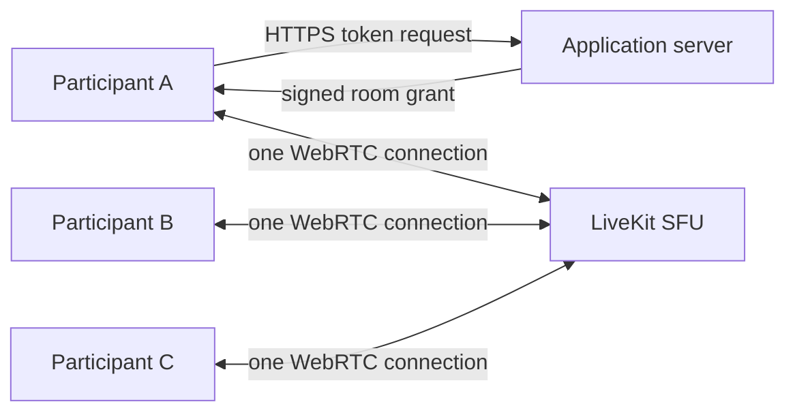

# System architecture

## Architectural goals

Social Square is built around four requirements:

1. Render an interactive, collision-aware world in the browser.
2. synchronize room presence and movement with low perceived latency.
3. support multi-party audio/video without browser-to-browser mesh scaling.
4. keep product iteration simple enough for a single deployable application.

These goals produce a **hybrid real-time monolith**. Page rendering, HTTP APIs, WebSocket coordination, and media-token issuance share a Node process, while PostgreSQL and LiveKit remain managed external systems.

## System context

The application server is the control plane for identity and room coordination. LiveKit is the media data plane. This prevents audio/video packets from consuming the application server's bandwidth while keeping room access under application control.

## Container view

### Why one listener matters

Development and production start the custom server, not a standalone `next start` process. The server prepares Next.js, attaches Socket.IO at a custom path, registers the LiveKit token endpoint, and forwards all other HTTP requests to Next.js. This avoids a second port and lets cookies, pages, APIs, and WebSocket upgrades share the same origin.

## Runtime responsibility map

| Responsibility | Owner | Communication | State |
|---|---|---|---|
| Page/UI rendering | Next.js + React | HTTP, React props/state | Browser session |
| Shared user state | Zustand | In-process client store/local storage | Partially browser-persisted |
| World rendering and collisions | Phaser scene | Game loop + browser events | Browser session |
| Player synchronization | Socket.IO | WebSocket/fallback transport | Server memory + live broadcasts |
| Chat | Socket.IO + React component | Room broadcast | Browser state only |
| Owner and role coordination | Socket.IO server | Validated room events | Server memory |
| Audio/video/screen share | LiveKit | WebRTC through hosted SFU | Live media session |
| Media authorization | Express token route | HTTPS token request | Short-lived signed grant |
| Accounts and profiles | Next.js route handlers + Prisma | HTTPS/SQL | PostgreSQL |
| Route authorization | Next.js proxy + JWT helpers | HTTP-only cookies | Signed token + database refresh allowlist |
| Delivery | GitHub Actions + AWS services | Image push + remote command | Container/image registry |

## State ownership and lifetime

The durable room schema currently describes future room configuration and membership. The live join path does not create or query those rows. Any non-empty room ID can currently create an in-memory room, and that room disappears after its final participant leaves or the process restarts.

## End-to-end room entry

The three branches begin from the room integration surface and complete independently. A media failure can leave the game and Socket.IO experience usable; a missing socket prevents multiplayer state but does not change the local rendering architecture.

## Movement synchronization

1. Phaser reads keyboard state during its update loop and applies local velocity.
2. Arcade Physics resolves local collision against configured tile layers.
3. When coordinates change, the client emits position and active animation.
4. The server updates the player's in-memory record and relays the event to the rest of the Socket.IO room.
5. Each remote client creates or repositions the matching sprite and plays the reported animation.

This is a relay-authoritative room registry, but not a fully server-simulated game. The browser calculates movement and collision; the server records and rebroadcasts the client-provided result. See [Design decisions](DESIGN_DECISIONS.md#movement-authority) for the consequence.

## Media architecture

The application server never forwards media. Each participant connects once to the SFU, publishes local tracks, and subscribes to remote tracks. Screen share is an additional track source. The client uses adaptive streaming, dynacast, automatic subscription, reconnect listeners, and bounded connection retries.

## Trust boundaries

- The browser is untrusted. Form inputs are validated again in route handlers.
- Access and refresh tokens live in HTTP-only cookies, limiting direct JavaScript access.
- Refresh JWTs are checked against a database record, enabling revocation.
- Only the active Socket.IO owner may change user roles or table assignments.
- OAuth state cookies protect callback flows against cross-site request forgery.
- Media signing secrets remain server-side; the browser receives only a scoped signed token.
- The current media-token endpoint checks room/username presence but does not yet require an authenticated application session or durable room membership. This is a documented hardening item.

## Scaling boundary

The current single process defines the first scaling limit. Multiple application replicas would not share room memory or Socket.IO broadcasts. Horizontal scaling requires, at minimum:

1. a shared Socket.IO adapter such as Redis;
2. external authoritative room/presence state or sticky ownership rules;
3. cross-replica cleanup and owner-election behavior;
4. durable/object storage for uploaded avatars;
5. health probes, rollout strategy, and shared observability.

LiveKit already removes the application server from the media scaling path. PostgreSQL already externalizes durable identity data. The remaining coupling is concentrated in the active-room registry.
