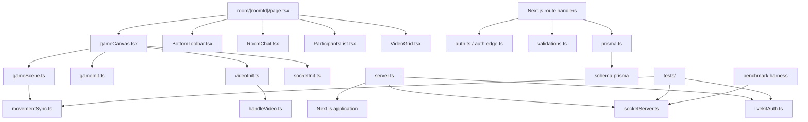

# Component and file map

This document maps the private repository by responsibility without reproducing proprietary implementation. Published paths identify component ownership and interaction boundaries; file contents remain private.

## Repository topology

```text
Social-Square/
├── .github/workflows/deploy.yml      CI/CD pipeline
├── benchmarks/                       Load harness, thresholds, and evidence
├── prisma/
│   ├── schema.prisma                 Durable domain model
│   └── migrations/                   Versioned PostgreSQL changes
├── public/
│   ├── assets/                       Sprite and visual assets
│   ├── tilemap/                      Tiled world definitions
│   └── tilesets/                     Map textures
├── src/
│   ├── app/
│   │   ├── api/                      Auth, profile, and upload handlers
│   │   ├── room/[roomId]/page.tsx    Main room integration surface
│   │   ├── state/atoms.tsx           Zustand client state
│   │   └── ...                       Landing, auth, onboarding, profile, settings
│   ├── components/                   Room and shared React UI
│   ├── lib/
│   │   ├── game/                     Phaser lifecycle, scene, movement policy
│   │   ├── sockets/                  Socket.IO client adapter
│   │   ├── video/                    LiveKit and media-element lifecycle
│   │   ├── auth.ts                   Node authentication helpers
│   │   ├── auth-edge.ts              Edge-compatible JWT verification
│   │   ├── prisma.ts                 Prisma singleton
│   │   └── validations.ts            Zod schemas
│   ├── server/
│   │   ├── socketServer.ts           Authenticated realtime room engine
│   │   └── livekitAuth.ts            Media-token authorization boundary
│   └── proxy.ts                      Next.js 16 route protection
├── tests/                             Movement, media-auth, and socket tests
├── server.ts                         Custom HTTP/WebSocket entry point
├── benchmarks_results.md             Canonical private evidence report
├── changes.md                        Implementation change record
├── Dockerfile                        Production image definition
├── next.config.ts                    Next.js configuration
├── prisma.config.ts                  Prisma configuration
└── package.json                      Scripts and dependency manifest
```

## Dependency spine



## Server and infrastructure

### `server.ts`

The lightweight process entry point and shared-listener boundary.

- Prepares Next.js and creates the shared Express/HTTP listener.
- Mounts Socket.IO at `/api/socket`.
- Registers the extracted authenticated realtime handler.
- Delegates LiveKit request authorization to the extracted media-auth module before signing scoped grants.
- Delegates all remaining HTTP requests to Next.js.

The process depends on Express, Node HTTP, Next.js, Socket.IO, the LiveKit Server SDK, extracted server modules, and environment configuration.

### `src/server/socketServer.ts`

Owns the realtime room engine used by production, integration tests, and the benchmark harness.

- Parses the access-token cookie during the Socket.IO handshake and rejects missing or invalid sessions.
- Stores verified user identity and joined room on the server-side socket.
- Validates room IDs, finite movement coordinates, message content/length, and allowed role values.
- Owns the in-memory map of active rooms, players, owner, user roles, and table assignments.
- Handles join, movement, chat, role assignment, explicit leave, disconnect cleanup, owner handoff, and empty-room deletion.
- Uses one cleanup path for explicit leave and disconnect behavior.
- Exposes optional detailed counters for tests and benchmarks; normal production handling does not increment benchmark-only metrics.

### `src/server/livekitAuth.ts`

Validates LiveKit token requests independently of token signing. It requires an authenticated application cookie, rejects identity mismatch, validates room IDs, and returns the verified identity and room grant input. Focused authorization tests exercise this boundary directly.

### `Dockerfile`

A two-stage Node 20 image definition. The builder installs dependencies, generates Prisma artifacts, builds Next.js, compiles the custom server and imported server modules, and prunes development packages. The runner contains production dependencies, Next output, public assets, Prisma files, and compiled server output.

### `.github/workflows/deploy.yml`

The main-branch delivery workflow. It builds a Linux AMD64 image, pushes it to ECR, and uses AWS Systems Manager to replace the running EC2 container. Application secrets stay in a host-side environment file and are not embedded in the image or workflow source.

## Room integration layer

### `src/app/room/[roomId]/page.tsx`

The React composition root for a live room.

- Owns media connection and toolbar state: connected, microphone, camera, screen share, and loading flags.
- Owns meeting, chat, and participant panel state.
- Receives the initialized Socket.IO client and LiveKit room from the game wrapper.
- Receives room state through the socket initializer's already-active listener and forwards it to Phaser with a browser `CustomEvent`.
- Updates participant counts from LiveKit connect/disconnect events rather than polling.
- Positions the floating local video bubble using Phaser player/camera coordinates.
- Emits explicit leave before navigating away.

Phaser handles the world, Socket.IO handles coordination, LiveKit handles media, and focused React components handle panels.

### `src/components/BottomToolbar.tsx`

Presentation and interaction surface for microphone, camera, screen sharing, meeting/chat/participant panels, and leave. It receives state and callbacks from the room page rather than owning transport logic.

### `src/components/ParticipantsList.tsx`

Builds the participant view from LiveKit media state and Socket.IO room state. It shows media indicators and exposes owner-only role/table controls. Rebuilds are debounced, participant matching uses a username index, and role mutations omit client-authoritative room IDs before returning to the server for validation.

### `src/components/RoomChat.tsx`

Owns visible chat history for the mounted room page. It publishes only message content and timestamp, consumes room broadcasts, creates join/leave notices, applies sender styling, caps history at 300 messages, and schedules the newest-message scroll through one animation frame. History is not stored server-side.

### `src/components/VideoGrid.tsx`

Translates LiveKit participants and track publications into responsive media tiles. It responds to participant, publication, subscription, mute, speaker, and connection-quality events. Camera and screen-share publications become separate tile types; screen share spans the grid.

## Phaser world

### `src/lib/game/gameCanvas.tsx`

The React-to-imperative lifecycle bridge.

- Creates and retains Phaser game, Socket.IO client, LiveKit room, and media-element references.
- Initializes sockets, the game, and LiveKit when a username is available.
- Reports initialized transports and room state to the room page.
- Performs coordinated cleanup on unmount.
- Retains a commented proximity-audio consumer, but no active distance emitter feeds it.

### `src/lib/game/gameInit.ts`

Creates the Phaser game with Arcade Physics, responsive sizing, pixel-art rendering, and the main scene. Its cleanup function destroys the game instance and releases the canvas lifecycle.

### `src/lib/game/gameScene.ts`

Owns real-time world behavior.

- Loads the Tiled map, tilesets, and player sprite sheet.
- Creates floor, wall, border, furniture, object, and hidden collision layers.
- Configures local sprite physics, animation, keyboard input, camera follow/bounds, responsive zoom, and world bounds.
- Creates, removes, and updates remote sprite targets from Socket.IO callbacks.
- Emits movement snapshots at no more than 20 Hz while moving and sends a final stop snapshot immediately.
- Interpolates remote sprites with a frame-rate-independent factor and snaps corrections above 200 world units.
- Renders four table labels from room state and detects local entry into table zones.
- Does not run the earlier unused avatar-distance calculation.

### `src/lib/game/movementSync.ts`

Defines the shared 20 Hz snapshot rate, the decision to send moving/final-stop snapshots, and the bounded frame-rate-independent interpolation factor. Unit tests and the benchmark harness use the same policy source.

## Real-time and media adapters

### `src/lib/sockets/socketInit.ts`

Creates the same-origin Socket.IO connection at `/api/socket` using the HTTP-only access cookie, tries WebSocket first with polling fallback, joins the requested room, and maps network events into Phaser scene methods. One active room-state listener supplies React state and initial Phaser hydration, avoiding the earlier startup race and duplicate listener.

### `src/lib/sockets/socketConnection.ts`

A supporting socket connection module retained in the repository. The active room lifecycle is centered on `socketInit.ts`; this secondary file is not the primary orchestration path.

### `src/lib/video/videoInit.ts`

Requests an authenticated LiveKit token, creates the LiveKit room, configures adaptive streaming/dynacast, attaches participant and reconnect listeners, connects with bounded retries, captures local microphone/camera tracks, and publishes them. Existing and newly subscribed remote publications pass to the media-element layer.

### `src/lib/video/handleVideo.ts`

Owns DOM media-element creation, attachment, detachment, participant cleanup, whole-room disconnect, and map cleanup. This isolates mutable media-element handling from React/Phaser integration code.

## Identity and application state

### `src/app/state/atoms.tsx`

The Zustand store for authentication and current-user data. Username and authentication status are persisted in browser storage; the complete user record is rehydrated from the authenticated `me` endpoint.

### `src/components/AuthProvider.tsx`

Runs session hydration for the React application, fetching the current authenticated user and updating the store.

### `src/components/OnboardingGuard.tsx`

Redirects authenticated users whose profile is incomplete into onboarding before protected product use.

### `src/lib/auth.ts` and `src/lib/auth-edge.ts`

Provide password/JWT behavior across Node and Edge runtimes. The Node helpers own bcrypt and token creation/verification; the Edge-compatible helper supports proxy route checks.

### `src/lib/validations.ts`

Central Zod schemas for signup, login, profile/onboarding data, and room-related inputs. Validation at the API boundary prevents relying on browser-only checks.

### `src/proxy.ts`

The single Next.js 16 route-protection implementation. It protects room and account surfaces and redirects already-authenticated users away from login/signup. The empty legacy middleware was removed, restoring the production build.

## Data and routes

### `prisma/schema.prisma`

Defines users, durable refresh tokens, planned durable rooms, room membership, and related enums. See [Data, auth, and API](DATA_AUTH_API.md) for the model/status distinction.

### `src/app/api/**/route.ts`

Next.js route handlers implement signup/login/logout/refresh, current-user lookup, password change/reset, OAuth starts/callbacks, profile updates, and avatar upload. The LiveKit token route remains in `server.ts` because it belongs to the custom Express server, with its authorization logic extracted into `src/server/livekitAuth.ts`.

## Verification and performance assets

### `tests/`

Contains three movement-policy unit tests, three LiveKit authorization tests, and four Socket.IO integration tests. The integration suite starts temporary servers around the production realtime handler.

### `benchmarks/`

Contains the authenticated Socket.IO load harness, protocol server wrapper, predeclared thresholds, runbook, result manifest, and 18 raw baseline/optimized/capacity/soak/validation artifacts. See the public [verification report](VERIFICATION_AND_BENCHMARKS.md) for results and limitations.

### `changes.md` and `benchmarks_results.md`

Private-repository documents that record the security/correctness/performance change set and the canonical detailed benchmark report. Their public-safe findings are incorporated throughout this blueprint.

## Public pages and shared UI

The App Router also contains the landing page, FAQ, authentication screens, onboarding, join-room flow, loader, profile, settings, and reset-password UI. Shared UI primitives live under `src/components/ui/` and are composed with Tailwind CSS, Radix primitives, shadcn-style patterns, and Framer Motion.
