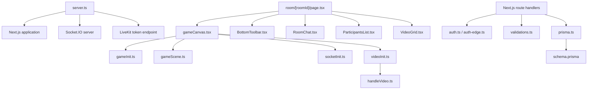

# Component and file map

This document maps the private repository by responsibility without reproducing proprietary implementation. Published paths identify component ownership and interaction boundaries; file contents remain private.

## Repository topology

```text
Social-Square/
├── .github/workflows/deploy.yml      CI/CD pipeline
├── prisma/
│   ├── schema.prisma                 Durable domain model
│   └── migrations/                   Versioned PostgreSQL changes
├── public/
│   ├── assets/                       Sprite and visual assets
│   ├── tilemap/                      Tiled world definitions
│   └── tilesets/                     Map textures
├── src/
│   ├── app/
│   │   ├── api/                      Auth, profile, and upload handlers
│   │   ├── room/[roomId]/page.tsx    Main room integration surface
│   │   ├── state/atoms.tsx           Zustand client state
│   │   └── ...                       Landing, auth, onboarding, profile, settings
│   ├── components/                   Room and shared React UI
│   ├── lib/
│   │   ├── game/                     Phaser lifecycle and scene logic
│   │   ├── sockets/                  Socket.IO client adapter
│   │   ├── video/                    LiveKit and media-element lifecycle
│   │   ├── auth.ts                   Node authentication helpers
│   │   ├── auth-edge.ts              Edge-compatible JWT verification
│   │   ├── prisma.ts                 Prisma singleton
│   │   └── validations.ts            Zod schemas
│   ├── proxy.ts                      Current route-protection entry point
│   └── middleware.ts                 Legacy duplicate pending removal
├── server.ts                         Custom HTTP/WebSocket server
├── Dockerfile                        Production image definition
├── next.config.ts                    Next.js configuration
├── prisma.config.ts                  Prisma configuration
└── package.json                      Scripts and dependency manifest
```

## Dependency spine



## Server and infrastructure

### `server.ts`

The process entry point and central coordination boundary.

- Prepares Next.js and creates the shared Express/HTTP listener.
- Mounts Socket.IO at `/api/socket`.
- Owns the in-memory map of active rooms, players, owner, user roles, and table assignments.
- Handles join, movement, chat, role assignment, explicit leave, disconnect cleanup, owner handoff, and empty-room deletion.
- Issues scoped LiveKit join/publish/subscribe tokens.
- Delegates all remaining HTTP requests to Next.js.

**Depends on:** Express, Node HTTP, Next.js, Socket.IO server, LiveKit Server SDK, environment configuration.

**Consumed by:** Browser Socket.IO clients and the complete HTTP application.

### `Dockerfile`

A two-stage Node 20 image definition. The builder installs dependencies, generates Prisma artifacts, builds Next.js, compiles the custom server, and prunes development packages. The runner contains the production dependencies, Next output, public assets, Prisma files, and compiled server.

### `.github/workflows/deploy.yml`

The main-branch delivery workflow. It builds a Linux AMD64 image, pushes it to ECR, and uses AWS Systems Manager to replace the running EC2 container. Application secrets stay in a host-side environment file and are not embedded in the image or workflow source.

## Room integration layer

### `src/app/room/[roomId]/page.tsx`

The React composition root for a live room.

- Owns media connection and toolbar state: connected, mic, camera, screen share, and loading flags.
- Owns panel state: meeting, chat, and participant views.
- Receives the initialized Socket.IO client and LiveKit room from the game wrapper.
- Listens for room-state broadcasts and forwards them to Phaser with a browser `CustomEvent`.
- Derives participant count and local control state from LiveKit events.
- Positions the floating local video bubble using Phaser player/camera coordinates.
- Emits explicit leave before navigating away.

It acts as the orchestration layer. Phaser handles the world, Socket.IO handles coordination, LiveKit handles media, and focused React components handle panels.

### `src/components/BottomToolbar.tsx`

Presentation and interaction surface for microphone, camera, screen sharing, meeting/chat/participant panels, and leave. It receives state and callbacks from the room page rather than owning transport logic.

### `src/components/ParticipantsList.tsx`

Builds the participant view from LiveKit media state and Socket.IO room state. It shows media indicators and exposes owner-only role/table assignment controls. Role mutations return to the server, where ownership is validated.

### `src/components/RoomChat.tsx`

Owns visible chat history for the current mounted page. It publishes messages through Socket.IO, consumes room broadcasts, creates join/leave system notices, applies local/remote sender styling, and keeps the newest message visible. History is not stored server-side.

### `src/components/VideoGrid.tsx`

Translates LiveKit participants and track publications into responsive media tiles. It responds to participant, publication, subscription, mute, speaker, and connection-quality events. Camera and screen-share publications become separate tile types; screen share spans the grid.

## Phaser world

### `src/lib/game/gameCanvas.tsx`

The React-to-imperative lifecycle bridge.

- Creates and retains Phaser game, Socket.IO client, LiveKit room, and media-element references.
- Initializes sockets, the game, and LiveKit when a username is available.
- Reports initialized transports back to the room page.
- Performs coordinated cleanup on unmount.
- Contains the disabled proximity-audio consumer, documenting the intended future link from spatial distance to media volume.

### `src/lib/game/gameInit.ts`

Creates the Phaser game with Arcade Physics, responsive sizing, pixel-art rendering, and the main scene. Its cleanup function destroys the game instance and releases the canvas lifecycle.

### `src/lib/game/gameScene.ts`

Owns real-time world behavior.

- Loads the Tiled map, tilesets, and player sprite sheet.
- Creates floor, wall, border, furniture, object, and hidden collision layers.
- Configures local sprite physics, directional animation, keyboard input, camera follow/bounds, responsive zoom, and world bounds.
- Creates/removes/updates remote sprites from Socket.IO callbacks.
- Emits movement only when local coordinates change.
- Renders four table labels from room state and detects local entry into table zones.
- Calculates distances to named remote players every 100 ms and dispatches browser proximity events.

The scene does not own authentication, durable rooms, chat rendering, or media transport.

## Real-time adapters

### `src/lib/sockets/socketInit.ts`

Creates the same-origin Socket.IO connection at `/api/socket`, publishes the username handshake, joins the requested room, and maps network events into Phaser scene methods. It temporarily buffers the initial player snapshot when the socket becomes ready before the Phaser scene does.

### `src/lib/sockets/socketConnection.ts`

A supporting socket connection module retained in the repository. The active room lifecycle is centered on `socketInit.ts`; this secondary file is not the primary orchestration path.

### `src/lib/video/videoInit.ts`

Requests a LiveKit token, creates the LiveKit room, configures adaptive streaming/dynacast, attaches participant and reconnect listeners, connects with bounded retries, captures local microphone/camera tracks, and publishes them. Existing and newly subscribed remote publications are passed to the media-element layer.

### `src/lib/video/handleVideo.ts`

Owns DOM media-element creation, attachment, detachment, participant cleanup, whole-room disconnect, and map cleanup. This isolates mutable `<video>`/`<audio>` handling from the React/Phaser integration code.

## Identity and application state

### `src/app/state/atoms.tsx`

The Zustand store for authentication and current-user data. Username and authentication status are persisted in browser storage; the complete user record is rehydrated from the authenticated `me` endpoint.

### `src/components/AuthProvider.tsx`

Runs session hydration for the React application, fetching the current authenticated user and updating the store.

### `src/components/OnboardingGuard.tsx`

Redirects authenticated users whose profile is incomplete into onboarding before protected product use.

### `src/lib/auth.ts`

Node-side password and JWT helpers: bcrypt hashing/comparison, access/refresh token creation, token verification, expiry calculation, and cookie-related values.

### `src/lib/auth-edge.ts`

Edge-compatible token verification used by the route-protection layer, avoiding Node-only dependencies in that runtime.

### `src/lib/validations.ts`

Central Zod schemas for signup, login, profile/onboarding data, and room-related inputs. Validation at the API boundary prevents trusting browser-only checks.

### `src/proxy.ts` and `src/middleware.ts`

`proxy.ts` is the Next.js 16 route-protection implementation. It protects room and account surfaces and redirects already-authenticated users away from login/signup. `middleware.ts` is a legacy duplicate. Their simultaneous presence currently blocks a clean Next.js 16.2.x build.

## Data and routes

### `prisma/schema.prisma`

Defines users, durable refresh tokens, planned durable rooms, room membership, and related enums. See [Data, auth, and API](DATA_AUTH_API.md) for the model/status distinction.

### `src/app/api/**/route.ts`

Next.js route handlers implement signup/login/logout/refresh, current-user lookup, password change/reset, OAuth starts/callbacks, profile updates, and avatar upload. The LiveKit token route is the exception: it lives in `server.ts` because it is part of the custom Express server.

## Public pages and shared UI

The App Router also contains the landing page, FAQ, authentication screens, onboarding, join-room flow, loader, profile, settings, and reset-password UI. Shared UI primitives live under `src/components/ui/` and are composed with Tailwind CSS, Radix primitives, shadcn-style patterns, and motion libraries.
