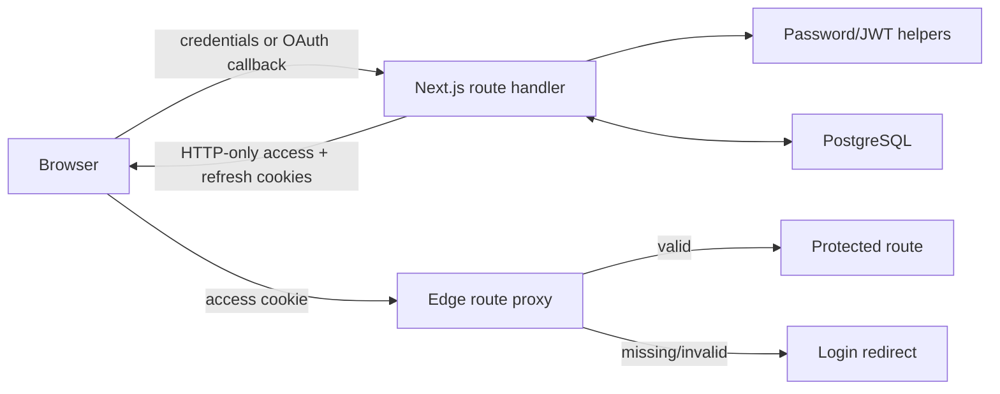

# Data, authentication, and API

## Persistence model

Prisma connects the application to PostgreSQL. The schema contains both production-used identity models and room models that are not yet connected to the live join flow.

```mermaid
erDiagram
    User ||--o{ RefreshToken : owns
    User ||--o{ Room : creates
    User ||--o{ RoomMember : joins
    Room ||--o{ RoomMember : contains

    User {
        string id PK
        string username UK
        string email UK
        string passwordHash nullable
        string oauthProvider nullable
        string oauthId nullable
        string avatar nullable
        enum status
        enum userType nullable
        enum role nullable
        boolean onboardingComplete
        string resetToken nullable
        datetime resetTokenExpiry nullable
    }
    RefreshToken {
        string id PK
        string token UK
        string userId FK
        datetime expiresAt
    }
    Room {
        string id PK
        string roomId UK
        string name
        int maxCapacity
        boolean isPrivate
        string password nullable
        boolean allowScreenShare
        boolean allowChat
        int autoAFKMinutes
        string createdBy FK
    }
    RoomMember {
        string id PK
        string userId FK
        string roomId FK
        enum role
        datetime joinedAt
        datetime leftAt nullable
        int totalTimeSpent
    }
```

## Model status

| Model | Important data | Used by current live flow? |
|---|---|---|
| `User` | Credentials/OAuth identity, avatar, status, onboarding, student/work profile, reset token | Yes |
| `RefreshToken` | Token allowlist, user relationship, expiry | Yes |
| `Room` | Public ID, metadata, capacity, privacy, password, collaboration flags, creator | Schema and migration exist; no current room CRUD/join integration |
| `RoomMember` | User-room role, join/leave timestamps, accumulated time | Schema and migration exist; not connected to live Socket.IO membership |

Schema enums include `STUDENT`/`REMOTE_WORKER`, `LEADER`/`MEMBER` work roles, multiple user-presence statuses, and `LEADER`/`MEMBER`/`VIEWER` durable room roles. The Socket.IO coordination roles are a separate current runtime concept.

## Authentication architecture



### Password signup/login

1. The handler parses the request through Zod.
2. Signup checks unique identity fields and hashes the password with bcrypt.
3. Login retrieves the user and refuses password login for OAuth-only accounts.
4. Successful authentication updates activity, signs access and refresh JWTs, stores the refresh token in PostgreSQL, and writes HTTP-only cookies.
5. The response returns a safe user projection rather than the password hash.

### Token lifecycle

- Access token lifetime: **15 minutes**.
- Refresh token lifetime: **7 days**.
- Both are stored in HTTP-only cookies; production cookies are marked secure.
- Refresh checks the signed token and the database allowlist record before issuing a new access token.
- Logout removes the current refresh record and clears cookies.
- Password change/reset revokes all refresh records for the account.
- The current browser client does not yet run a complete automatic refresh/retry loop when an access token expires.

### OAuth

Google and GitHub use authorization-code flows:

1. the start route generates state and stores it in a cookie;
2. the browser visits the provider;
3. the callback compares state, exchanges the code, retrieves provider identity, and finds/creates/links a local user;
4. the application issues its own access/refresh cookies;
5. new or incomplete accounts continue through onboarding.

### Password reset

The forgot-password route avoids revealing whether an email exists. For an existing user it creates a cryptographically random token with one-hour expiry and stores it on the user record. The reset route validates the token/expiry, hashes the replacement password, clears the reset fields, and revokes refresh sessions.

Email delivery is not implemented. The link is currently logged server-side and returned only in development.

## Route protection

The Next.js 16 proxy protects room, join, profile, settings, onboarding, and planned dashboard paths by verifying the access cookie in the Edge runtime. Authenticated users are redirected away from login/signup. Inside the application, `AuthProvider` rehydrates the current user through `/api/auth/me`, while `OnboardingGuard` enforces profile completion.

Route checks are useful navigation/security gates, but sensitive API handlers also validate tokens themselves. UI hiding is never treated as authorization.

## HTTP API surface

| Endpoint | Method | Gate | Responsibility |
|---|---:|---|---|
| `/api/auth/signup` | POST | Public | Validate/create password account and issue session cookies |
| `/api/auth/login` | POST | Public | Verify email/password and issue session cookies |
| `/api/auth/logout` | POST | Refresh cookie | Revoke current refresh token and clear cookies |
| `/api/auth/refresh` | POST | Refresh cookie + DB record | Issue a new access cookie |
| `/api/auth/me` | GET | Access cookie | Return current safe user/profile fields |
| `/api/auth/change-password` | POST | Access cookie | Verify old password, replace it, revoke refresh sessions |
| `/api/auth/forgot-password` | POST | Public | Create a one-hour reset token without account disclosure |
| `/api/auth/reset-password` | POST | Valid reset token | Replace password, clear reset state, revoke sessions |
| `/api/auth/oauth/google` | GET | Public | Begin Google OAuth and set state cookie |
| `/api/auth/oauth/github` | GET | Public | Begin GitHub OAuth and set state cookie |
| `/api/auth/oauth/callback/google` | GET | Matching OAuth state | Exchange identity and issue application session |
| `/api/auth/oauth/callback/github` | GET | Matching OAuth state | Exchange identity and issue application session |
| `/api/user/profile` | PUT | Access cookie | Validate and update onboarding/profile data |
| `/api/upload/avatar` | POST | Access cookie or signup user ID | Validate, write, and associate an avatar |
| `/api/livekit/token` | GET | Room/username parameters | Issue LiveKit join/publish/subscribe token |

The media-token endpoint is registered in the custom Express server. The other endpoints are Next.js App Router handlers.

## Profile and onboarding data

Onboarding branches by user type:

- Students can provide school and related profile information.
- Remote workers can provide leader/member role, job position, company, and related profile information.

Both paths can include username, biography, and avatar. Completion is stored explicitly, allowing route guards to distinguish authentication from product-ready onboarding.

## Avatar upload

The upload handler accepts JPEG, PNG, GIF, and WebP files up to 5 MB, writes them under the application's public avatar directory, and associates the resulting path with a user.

Current boundaries:

- files are local to the container filesystem;
- replacement deployments can remove them without a persistent mount;
- signup supports a form-supplied user ID path that needs stronger ownership verification;
- production evolution should move bytes to object storage and retain only immutable object metadata/URL in PostgreSQL.

## Data consistency boundaries

The application currently has two separate room concepts:

1. **Durable schema room:** metadata, privacy/capacity flags, collaboration policy, creator, membership, attendance.
2. **Live in-memory room:** Socket.IO players, coordinates, owner, coordination roles, table labels.

The live join/create UI currently routes directly to `/room/[roomId]`; it does not create, load, authorize, or enforce the durable room model. Connecting them is a major next step because it will establish a single lifecycle for admission, policy, presence, and history.

## Security hardening priorities

1. Require an authenticated user and authorized room membership for media tokens.
2. bind Socket.IO identity to the authenticated application session rather than a client-supplied username.
3. validate and rate-limit real-time payloads.
4. verify ownership for all avatar upload paths and migrate storage outside the container.
5. hash or rotate stored refresh-token material according to the final threat model.
6. integrate transactional reset email without logging reset links in production.
7. add content-security, origin, CSRF, and upload-scanning policy appropriate to production exposure.
