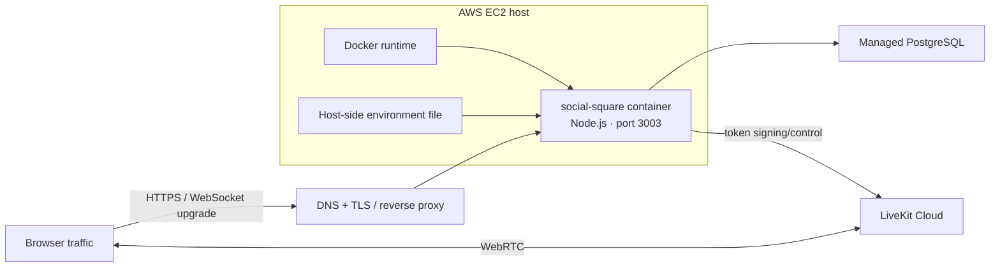
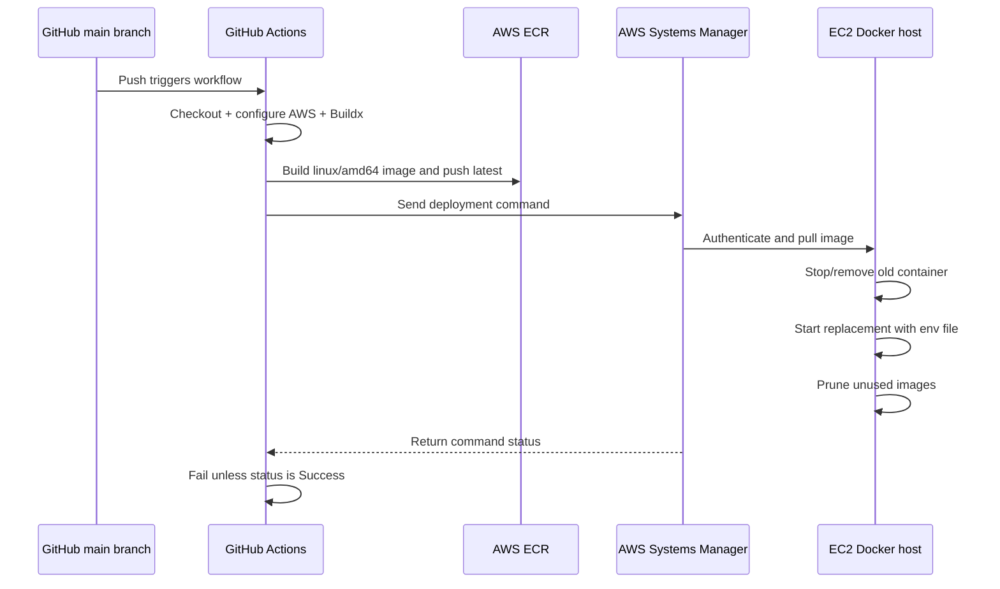

# Deployment and operations

## Production topology

Social Square is delivered as one Docker container on an AWS EC2 host. A reverse proxy/TLS boundary in front of the application exposes HTTPS, while the container listens on port 3003. Managed PostgreSQL holds durable application data and LiveKit Cloud handles WebRTC media.



DNS, TLS termination, host firewall/security groups, and reverse-proxy configuration are managed outside the application repository. The repository defines the container and delivery workflow, not the complete cloud estate.

## Container build

The Dockerfile uses two stages:

```text
builder
  install locked dependencies
  -> generate Prisma client
  -> build Next.js
  -> compile the custom TypeScript server
  -> prune development-only packages

runner
  copy production dependencies
  + Next.js build output
  + public assets
  + Prisma schema/migrations/client artifacts
  + compiled custom server
  -> expose port 3003
  -> run the custom Node server
```

The custom server must be the process entry point because a standalone Next.js process would omit Socket.IO and the Express media-token route.

## CI/CD flow

Pushes to `main` trigger two dependent workflow jobs.



### Build job

1. Checks out the repository on a GitHub-hosted runner.
2. configures the AWS CI identity.
3. authenticates Docker to ECR.
4. configures Buildx.
5. builds a Linux AMD64 image and pushes the mutable `latest` tag.

### Deploy job

1. Waits for the build job.
2. sends a remote shell command through Systems Manager rather than deploying over SSH.
3. logs the EC2 host into ECR and pulls the new image.
4. replaces the existing named container.
5. injects the host-side environment file, publishes port 3003, and uses `unless-stopped` restart behavior.
6. waits for remote completion and propagates command failure to GitHub Actions.

## Configuration and secret boundaries

| Configuration class | Typical examples | Boundary |
|---|---|---|
| Server secrets | Database connection, JWT signing key, LiveKit signing credentials, OAuth client secrets | Runtime environment only; never client bundle or repository |
| Public build config | Public LiveKit WebSocket URL, public application URL | Safe for client exposure, but must be injected at image build when bundled |
| Delivery credentials | AWS CI identity and target instance reference | GitHub Actions secret store |
| Host runtime config | Production application environment values | EC2-side environment file |
| Repository config | Port defaults, framework config, schema, workflow logic | Version controlled, no secret values |

`NEXT_PUBLIC_*` values are compiled into browser assets and are not secret. The current source contains a hosted LiveKit URL fallback, but custom builds should inject the intended public URL explicitly.

## Persistence implications

| Asset/state | Current location | Survives container replacement? |
|---|---|---:|
| User/profile/token rows | Managed PostgreSQL | Yes |
| Active room registry | Node process memory | No |
| Chat history | Connected browser memory | No |
| Live media | LiveKit session | No; clients reconnect |
| Uploaded avatars | Container public directory | Not reliably |
| Application logs | Container/host output | Depends on host log retention |

Avatar storage and active room state are the primary persistence boundaries. Uploaded media should move to object storage. Shared ephemeral state, such as Redis with a defined room-state model, is required before horizontal application scaling.

## Deployment behavior and risk

The current rollout is a **single-container replacement**, not a rolling or blue/green deployment.

- There can be a brief availability gap between stopping the old container and starting the new one.
- All WebSocket sessions and in-memory room state terminate during replacement.
- The image uses a mutable `latest` tag, reducing rollback precision.
- Workflow success proves that the remote command completed, not that the application passed an HTTP/WebSocket/media smoke test.
- There is no automatic rollback in the checked-in workflow.

## Current operational verification

The private repository was checked on 14 September 2026:

| Command | Result | Evidence |
|---|---|---|
| `npm run build` | Fails before compilation | Next.js 16.2.x detects both legacy `middleware.ts` and `proxy.ts` |
| `npm run lint` | Fails at command invocation | The script still calls the removed `next lint` path |
| `npx tsc --noEmit` | Fails with two errors | Possibly undefined database URL in Prisma config; nullable OAuth password hash passed to bcrypt in password change |

`next.config.ts` currently allows production builds to ignore TypeScript build errors, but the middleware/proxy conflict occurs earlier and still stops a fresh build. These findings are documented so the public blueprint does not imply a green pipeline that the audited checkout cannot reproduce.

## Operations checklist for the next production stage

### Build and release

- Remove the legacy middleware/proxy conflict.
- replace `next lint` with direct ESLint invocation and enforce it in CI.
- make standalone type checking green and required.
- tag images with immutable commit SHAs; optionally keep `latest` as a convenience pointer.
- apply Prisma migrations as an explicit, controlled deployment step.
- retain a previous known-good image and add automated rollback criteria.

### Health and observability

- Add liveness and readiness endpoints.
- smoke-test HTTP, WebSocket upgrade/join, database connectivity, and media-token issuance after deploy.
- collect structured logs with request/session correlation that excludes credentials/tokens.
- measure connected users, active rooms, join latency, Socket.IO event rate, reconnect rate, LiveKit failures, and database latency.
- add alerting on availability, restart loops, resource pressure, and elevated errors.

### Availability and scale

- move avatars to object storage/CDN.
- externalize Socket.IO broadcasts and live room state.
- run at least two application replicas behind a health-aware load balancer.
- define graceful shutdown so deployments stop admission, drain connections, and communicate reconnect state.
- add database backup/restore testing and capacity policy.

### Security

- minimize IAM permissions for CI and the EC2 role.
- rotate application and cloud credentials through managed secret storage.
- authenticate/authorize media-token requests.
- apply origin, rate-limit, and payload-validation policy to Socket.IO and token routes.
- avoid logging signed tokens, reset links, or sensitive request values.
