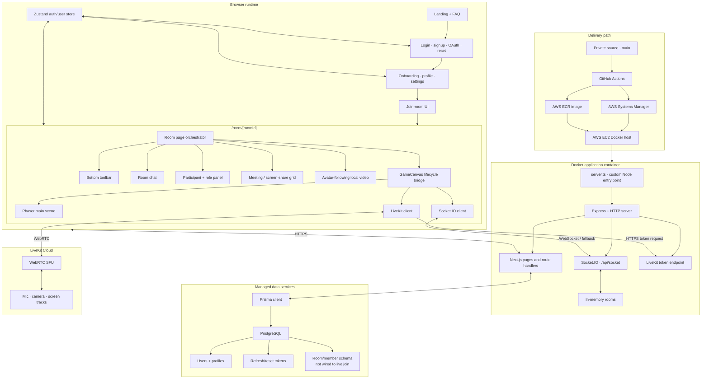

# Social Square full architecture map

This document provides a compact end-to-end reference. The focused documents provide additional rationale and implementation status.

## Complete system map



## Runtime paths

### Authentication path

```text
Auth page
-> Next.js auth route
-> Zod validation
-> bcrypt / OAuth provider
-> Prisma + PostgreSQL
-> access and refresh HTTP-only cookies
-> route proxy + AuthProvider
-> onboarding guard
```

### Multiplayer path

```text
Room page
-> Socket.IO connect and username handshake
-> join-room
-> server creates/loads in-memory room
-> existing player snapshot + room state
-> Phaser remote sprites
-> movement events relayed to peers
-> leave/disconnect cleanup + owner handoff
```

### Media path

```text
Room page
-> application media-token endpoint
-> signed LiveKit room grant
-> LiveKit SFU connection
-> local mic/camera publication
-> remote subscriptions
-> meeting grid / floating local camera
-> optional screen-share publication
```

### Role and table path

```text
Owner participant panel
-> assign-user-role or assign-table-role
-> server verifies current socket is room owner
-> in-memory room state mutation
-> room-state-update broadcast
-> participant panel refresh
-> browser CustomEvent
-> Phaser table label and zone behavior
```

### Deployment path

```text
Push to private main
-> GitHub Actions buildx
-> Linux AMD64 image in ECR
-> Systems Manager remote command
-> EC2 pulls image
-> old container replaced
-> custom Node server starts on port 3003
```

## Important private files

| Area | File | Responsibility |
|---|---|---|
| Process | `server.ts` | Next.js preparation, Express listener, Socket.IO room server, LiveKit token route |
| Room composition | `src/app/room/[roomId]/page.tsx` | Integrates game, sockets, media, panels, controls, and video bubble |
| Game lifecycle | `src/lib/game/gameCanvas.tsx` | Creates/cleans Phaser, Socket.IO, LiveKit, and media elements |
| Phaser setup | `src/lib/game/gameInit.ts` | Game configuration and teardown |
| World logic | `src/lib/game/gameScene.ts` | Map, physics, movement, remote sprites, tables, proximity distances |
| Socket adapter | `src/lib/sockets/socketInit.ts` | Same-origin connection, join, snapshot buffer, scene event mapping |
| Media connection | `src/lib/video/videoInit.ts` | Token fetch, LiveKit connect/retry, local publish, remote subscription |
| Media DOM | `src/lib/video/handleVideo.ts` | Media attachment/detachment and cleanup |
| Meeting UI | `src/components/VideoGrid.tsx` | Participant, camera, mute, and screen-share tiles |
| Chat UI | `src/components/RoomChat.tsx` | Current-session messages and join/leave notices |
| Coordination UI | `src/components/ParticipantsList.tsx` | Presence/media status and owner role/table controls |
| Controls | `src/components/BottomToolbar.tsx` | Media, panels, screen share, and leave actions |
| Client identity | `src/app/state/atoms.tsx` | Zustand auth/user state |
| Auth helpers | `src/lib/auth.ts`, `src/lib/auth-edge.ts` | Password/JWT behavior in Node and Edge runtimes |
| Validation | `src/lib/validations.ts` | Zod boundary schemas |
| Persistence | `prisma/schema.prisma` | User, token, room, and membership models |
| Access gate | `src/proxy.ts` | Protected/public route redirects |
| Container | `Dockerfile` | Multi-stage production image |
| Delivery | `.github/workflows/deploy.yml` | ECR build/push and SSM-driven EC2 replacement |

## State map

| State | Authority | Lifetime | Replicated how? |
|---|---|---|---|
| User/profile | PostgreSQL | Durable | Queried through Prisma |
| Refresh/reset token | PostgreSQL + signed token | Until expiry/revocation | HTTP cookie + database record |
| Durable room definition | PostgreSQL schema | Durable | Not used by current room path |
| Active room membership | Socket.IO server memory | Process/room lifetime | `room-state-update` snapshots |
| Position/animation | Local client then server registry | Live connection | `player-move` events |
| Owner/user roles/tables | Socket.IO server memory | Process/room lifetime | Server-validated state broadcasts |
| Chat | Each browser | Mounted page lifetime | Live broadcast only, no replay |
| Camera/mic/screen | LiveKit | Media session | SFU publications/subscriptions |
| UI panel/control state | React component state | Mounted room page | Local only |

## Current architecture and next stage

| Concern | Current architecture | Next stage |
|---|---|---|
| Rooms | Any non-empty ID creates/joins ephemeral state | Authenticated, durable, policy-enforced rooms |
| Scaling | One application process | Shared adapter/state and multiple replicas |
| Movement | Client-calculated, direct remote updates | Validated, sequenced, interpolated updates |
| Proximity | Distances emitted; media handlers disabled | Feature-flagged attenuation/visibility with UX controls |
| Chat | Live, browser-only | Optional durable history with moderation/retention policy |
| Uploads | Container-local | Object storage/CDN |
| Delivery | Mutable tag, container replacement | Immutable releases, health checks, rollback, drain |
| Quality gates | Known build/lint/type failures | Required CI checks plus automated tests |

## Detailed references

- [System architecture](ARCHITECTURE.md)
- [Component map](COMPONENT_MAP.md)
- [Real-time protocol](REALTIME_PROTOCOL.md)
- [Data, authentication, and API](DATA_AUTH_API.md)
- [Deployment and operations](DEPLOYMENT_OPERATIONS.md)
- [Architecture decisions](DESIGN_DECISIONS.md)
- [Current state and roadmap](CURRENT_STATE.md)
