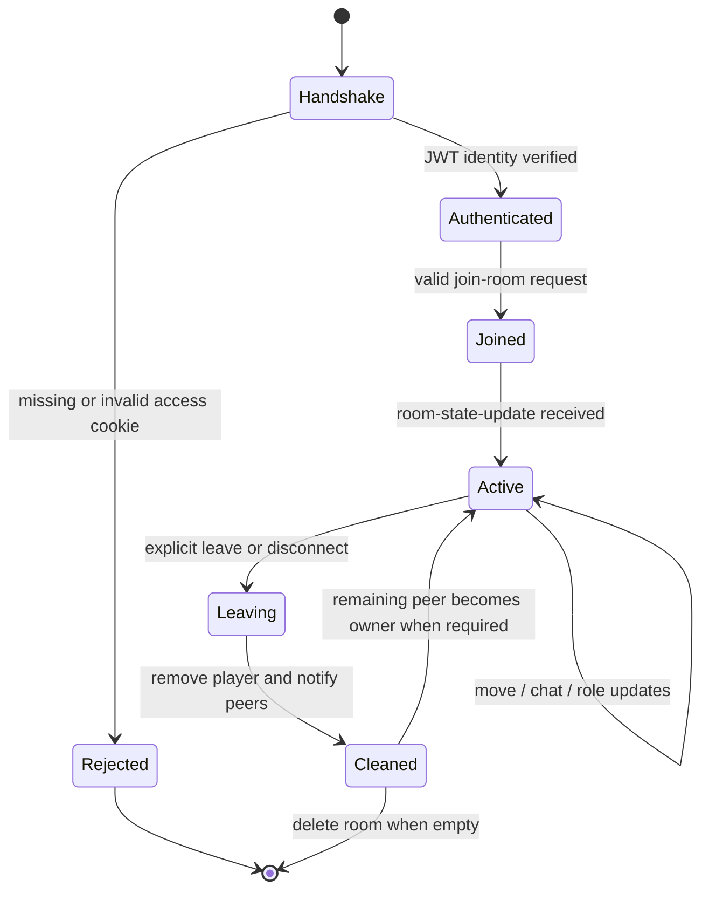
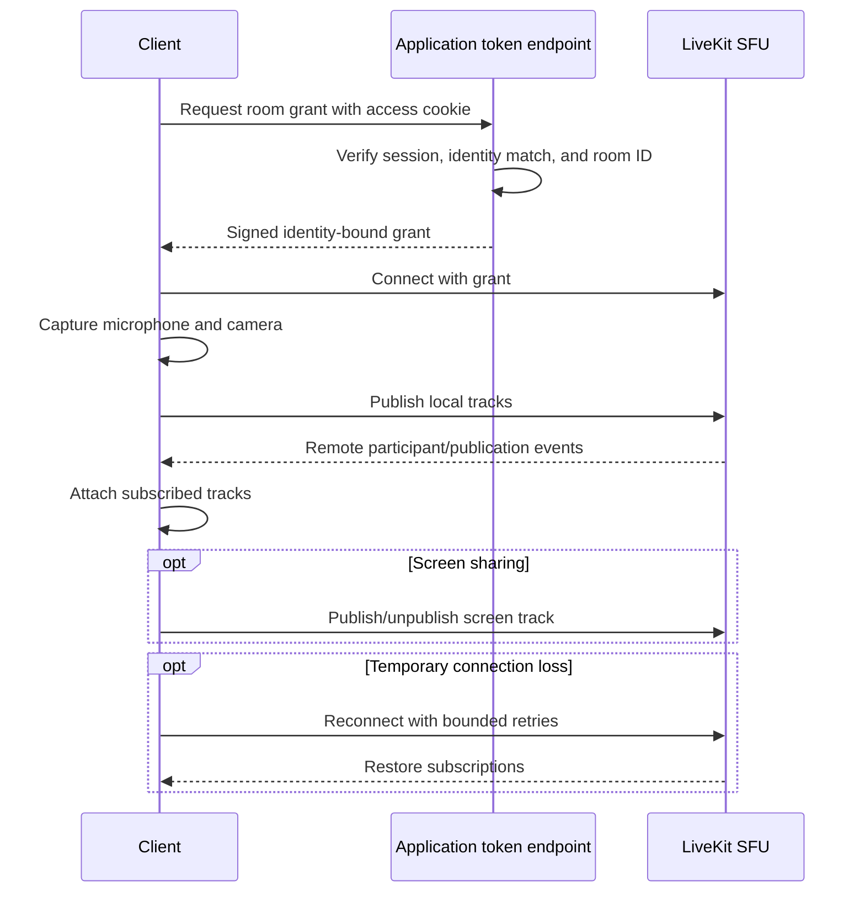

# Real-time protocol and room lifecycle

Social Square separates coordination traffic from media traffic:

- **Socket.IO** carries authenticated presence, movement, chat, owner state, user roles, and table assignments.
- **LiveKit/WebRTC** carries microphone, camera, and screen-share tracks through an SFU.

Both sessions use the same logical room identifier and verified application identity, but remain distinct connections with different failure and scaling behavior.

## Socket authentication and lifecycle



Socket.IO middleware reads the normal HTTP-only `accessToken` cookie. Missing or invalid tokens are rejected before the connection handler runs. The verified JWT identity is stored on the server-side socket and provides the username used in room state and chat.

The first socket in a new in-memory room becomes owner. Explicit leave and transport disconnect use the same cleanup function. If the departing socket is the owner, the server selects a remaining participant, assigns `Room Owner`, and broadcasts the new state.

## Event catalogue

All traffic uses `/api/socket`. Event handlers derive room and identity from server-side socket state; client payloads are not trusted to select another room or username.

| Event | Direction | Trigger | Effect | Durable? |
|---|---|---|---|---|
| `join-room` | Client to server | Room initializes | Validates ID, leaves previous room, creates room when absent, inserts authenticated player | No |
| `room-error` | Server to client | Invalid join request | Reports a bounded protocol error | No |
| `room-state-update` | Server to room | Join, role/table update, owner change | Sends owner, complete player map, roles, positions, and table assignments | No |
| `player-joined` | Server to peers | New participant inserted | Creates a remote avatar | No |
| `player-move` | Client to server to peers | 20 Hz movement snapshot or final stop | Validates finite coordinates, updates registry, relays position/animation | No |
| `player-left` | Server to peers | Explicit leave/disconnect | Removes the remote avatar | No |
| `leave-room` | Client to server | User leaves | Runs shared membership, owner, notification, and room cleanup | No |
| `chat-message` | Client to server to room | Valid chat send | Adds verified username, validates/normalizes text, broadcasts to room including sender | No |
| `user-joined` / `user-left` | Server to peers | Membership change | Creates local chat notices | No |
| `assign-user-role` | Owner client to server | Owner changes participant role | Validates owner, target, and role allowlist; broadcasts state | No |
| `assign-table-role` | Owner client to server | Owner changes table label | Validates owner, table ID, and role allowlist; broadcasts state | No |

The former username greeting and `existing-players` snapshot events were removed. `room-state-update` is now the single initial state source.

## Initial synchronization

```mermaid
sequenceDiagram
    participant Client as Joining client
    participant Middleware as Socket auth middleware
    participant Server as Realtime handler
    participant Peers as Existing clients
    participant Scene as Phaser scene

    Client->>Middleware: Connect with HTTP-only access cookie
    Middleware->>Middleware: Verify JWT and store identity
    Middleware-->>Client: Connection accepted
    Client->>Server: join-room(roomId)
    Server->>Server: Validate room; create if absent; insert player
    Server-->>Peers: player-joined + user-joined
    Server-->>Client: room-state-update(all players, owner, roles, tables)
    Server-->>Peers: room-state-update(...)
    Client->>Scene: Apply initial player map now or after scene activation
```

Socket and Phaser initialization occur close together. The socket initializer installs one room-state listener before joining. That listener feeds React state and hydrates Phaser from the first snapshot; if the scene is not active, it temporarily buffers only that initial player map until scene creation. This removes the earlier duplicate listener and startup race.

## Movement synchronization

The local Phaser loop remains display-frame-rate driven for immediate input and collision response. Network emission follows a separate policy:

1. while the avatar moves, send at most one snapshot every 50 ms (20 Hz);
2. send only when position changed;
3. send an immediate `turn` snapshot when movement stops;
4. keep room selection and sender identity on the server;
5. reject non-finite coordinates;
6. relay only to peers in the joined Socket.IO room.

Remote clients store the newest coordinate/animation target. During each render update they apply a bounded, frame-rate-independent exponential interpolation factor. Corrections above 200 world units snap directly, preventing a teleport or large correction from easing slowly across the map.

This remains a relay-authoritative room registry rather than a server-simulated world. The browser calculates movement and collisions; the server validates payload shape and room membership but does not yet enforce speed, map boundaries, collision legality, or ordered sequence numbers for ordinary browser traffic.

## Roles and table zones

Allowed coordination roles are:

- `Unassigned`
- `Room Owner`
- `Dev Team`
- `Design Team`
- `Testing`
- `Management`

Only the current owner may change participant or table roles. Both roles and the four valid table IDs are allowlisted. Ordinary role assignment cannot grant `Room Owner` to a different participant; ownership changes through lifecycle handoff.

The Phaser scene defines four rectangular table zones. A room-state update changes their labels. When the local avatar enters a zone and the table's role matches the participant's role, the scene shows a local welcome message. Table state remains process-local rather than a durable database relation.

## Chat behavior

The client sends message text and a display timestamp. The server uses the socket's joined room and authenticated username, trims content, rejects empty messages, and rejects messages over 2,000 characters. Valid messages are broadcast to the current room, including the sender.

The React component:

- caps each browser's visible history at 300 messages;
- appends join/leave notices;
- distinguishes local and remote senders; and
- schedules one instant scroll on the next animation frame instead of accumulating smooth-scroll animations.

Reloading or leaving clears browser history, and newly joined participants do not receive earlier messages. The server does not persist, moderate, paginate, or replay chat.

## LiveKit media lifecycle



The endpoint requires a valid application access cookie, rejects a requested username that differs from the JWT identity, validates the room ID, and signs the grant for the authenticated username. It does not yet check a durable `RoomMember` record because live rooms are not database-backed.

The LiveKit client uses automatic subscription, adaptive streaming, dynacast, reconnect listeners, and bounded retries. Local defaults include echo cancellation, noise suppression, automatic gain control, and a 640 x 480, 24 fps camera target.

## Proximity-media status

The current release does not calculate avatar distances. Earlier dormant distance emission was removed because no enabled media feature consumed it. Commented audio-volume and video-opacity handlers remain as design references, but no active event feeds them. All LiveKit room participants therefore remain audible and visible regardless of avatar distance.

## Disconnect and failure behavior

| Failure | Current response | Remaining limitation |
|---|---|---|
| Invalid Socket.IO session | Handshake rejected as unauthorized | Access refresh/retry UX remains incomplete |
| Invalid room ID | `room-error` returned without joining | Durable room admission is not yet checked |
| Socket disconnect | Shared cleanup removes player, notifies peers, hands off owner | Room state is lost if process restarts |
| Explicit leave | Uses the same cleanup path as disconnect | No durable leave record in current path |
| LiveKit authorization failure | Token request rejected | No durable room-membership decision yet |
| LiveKit connection loss | SDK reconnect behavior and track reattachment | No unified cross-transport recovery state |
| Phaser scene not ready | Initial player map is buffered | Buffer is browser-global and narrowly scoped |
| Container replacement | Socket sessions terminate; clients must reconnect | Active room roles/tables are erased |
| Multiple app replicas | Unsupported by process-local rooms | Requires shared adapter and external state |

## Verification coverage

The focused suite verifies unauthenticated Socket.IO rejection, room-isolated movement/chat, explicit leave, disconnect owner handoff, LiveKit authentication/identity binding, 20 Hz throttling, immediate stop snapshots, and bounded frame-rate-independent interpolation.

The load harness uses the production realtime handler with optional metrics and authenticated synthetic clients. See [Verification and benchmarks](VERIFICATION_AND_BENCHMARKS.md).

## Remaining hardening work

1. Enforce durable room membership and room policy for Socket.IO and LiveKit admission.
2. add rate limits for connection, join, chat, movement, and token issuance.
3. enforce movement speed/map bounds if world position becomes security-relevant.
4. add ordinary client sequence numbers and stronger recovery semantics where required.
5. externalize Socket.IO broadcasts and room state for multiple replicas.
6. add browser, WebRTC, staging-network, and deployment smoke coverage.
