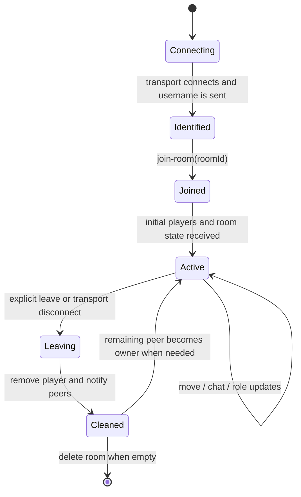
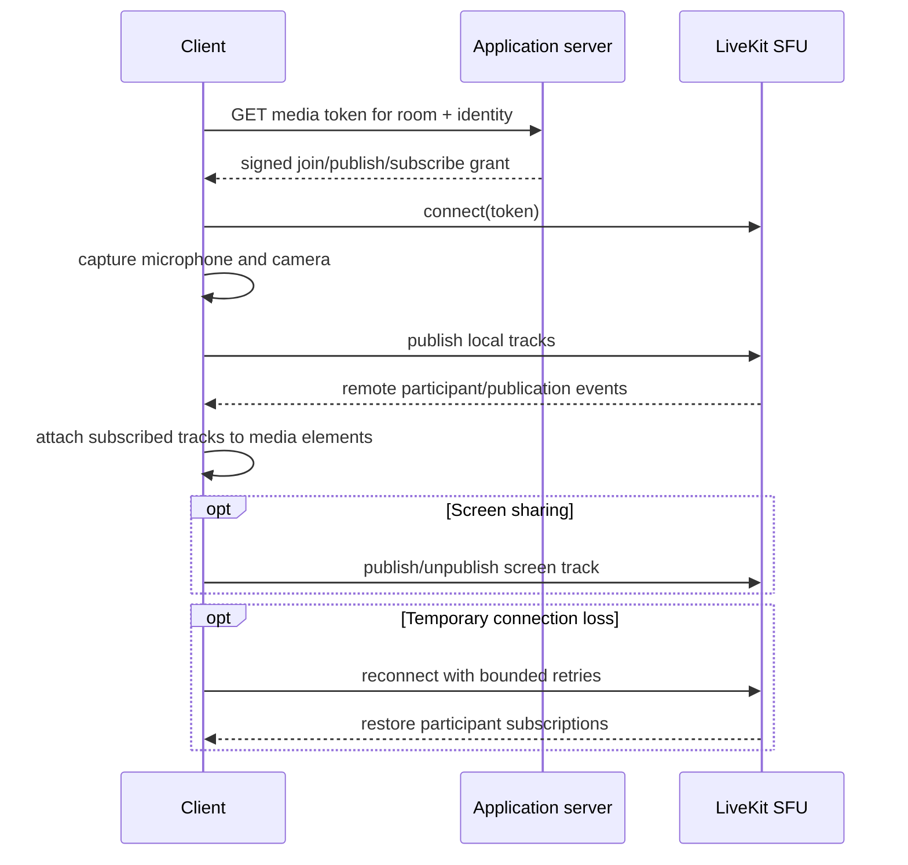

# Real-time protocol and room lifecycle

Social Square intentionally separates coordination traffic from media traffic:

- **Socket.IO** carries small, frequent state events: presence, movement, chat, owner state, user roles, and table assignments.
- **LiveKit/WebRTC** carries bandwidth-heavy microphone, camera, and screen-share tracks through an SFU.

Both sessions use the same logical room identifier, but they are distinct connections with different failure and scaling behavior.

## Socket connection lifecycle



The first socket in a newly created in-memory room is the owner. A later disconnect or explicit leave removes that player. If the departing player was owner, the server selects the first remaining connected socket, changes its role to `Room Owner`, and broadcasts the updated state.

## Event catalogue

All Socket.IO traffic uses the custom `/api/socket` path.

| Event | Direction | Trigger | Server/client effect | Durable? |
|---|---|---|---|---|
| `message` | Client and server | Connection handshake | Associates username with the socket; returns acknowledgement | No |
| `join-room` | Client to server | Room page initializes | Leaves any previous room, creates room state when absent, inserts player | No |
| `existing-players` | Server to joining client | Successful join | Seeds all known avatars, including positions | No |
| `player-joined` | Server to peers | New participant inserted | Creates the new remote avatar | No |
| `player-move` | Client to server to peers | Local coordinates changed | Updates registry, relays position and animation | No |
| `player-left` | Server to peers | Explicit leave/disconnect | Removes the remote avatar | No |
| `leave-room` | Client to server | User presses leave | Removes membership and performs owner/room cleanup | No |
| `chat-message` | Client to server to room | Chat send | Broadcasts sender, message, and timestamp to all room clients | No |
| `user-joined` | Server to peers | Successful join | Creates a local chat system notice | No |
| `user-left` | Server to peers | Transport disconnect | Creates a local chat system notice | No |
| `room-state-update` | Server to clients | Join, role/table update, owner change | Replaces owner/player/table coordination view | No |
| `assign-user-role` | Owner client to server | Owner changes a participant role | Server validates owner and target, then broadcasts state | No |
| `assign-table-role` | Owner client to server | Owner changes a table label | Server validates owner, updates table, broadcasts state | No |

## Initial synchronization

```mermaid
sequenceDiagram
    participant New as Joining client
    participant Server as Socket.IO server
    participant Peers as Existing clients
    participant Scene as Joining Phaser scene

    New->>Server: message(username)
    New->>Server: join-room(roomId)
    Server->>Server: create room if absent; insert player
    Server-->>New: existing-players(all players)
    Server-->>New: room-state-update(owner, roles, tables)
    Server-->>Peers: player-joined(new player)
    Server-->>Peers: room-state-update(...)
    Server-->>Peers: user-joined(username)
    New->>Scene: apply snapshot immediately or buffer until ready
```

Socket initialization and Phaser initialization happen close together. If the player snapshot arrives before the scene becomes active, the client temporarily stores it on the browser window and consumes it after scene creation. This avoids losing the first synchronization message due to initialization order.

## Movement behavior

The local browser performs keyboard input, collision detection, and position integration. It emits only after position changes, reducing idle traffic. The server stores the latest coordinates and relays them to peers without sending the update back to the originator.

Remote clients currently apply received positions directly. There is no interpolation buffer, reconciliation, tick sequence, or delta compression. This keeps the MVP understandable and responsive on ordinary connections, but visible jumps remain possible under latency or packet bursts.

### Authority model

The server is authoritative over room membership, current registry state, owner privileges, roles, and table assignments. It is **not authoritative over movement physics**: it accepts client-provided coordinates. That distinction matters for future validation and anti-cheat work.

## Roles and table zones

Built-in coordination roles are:

- `Unassigned`
- `Room Owner`
- `Dev Team`
- `Design Team`
- `Testing`
- `Management`

Only the current room owner may change user or table roles. The server also prevents assigning `Room Owner` to a different participant through the ordinary role event.

The Phaser scene defines four rectangular table zones. A room-state update changes their visible labels. When the local avatar enters a zone and the table's assigned role matches the local participant's role, the scene shows a local welcome message. Table membership itself is not a persistent database relation.

## Chat behavior

Messages are broadcast to all clients in the addressed Socket.IO room, including the sender. The React chat component retains the visible list, styles local versus remote messages, and appends join/leave notices.

Current consequences:

- Reloading or leaving clears that browser's chat history.
- New participants do not receive earlier messages.
- The server does not persist, moderate, paginate, or replay chat.
- The client supplies the displayed timestamp.

## LiveKit media lifecycle



The LiveKit room is configured for automatic subscription, adaptive streaming, and dynacast. Local defaults use echo cancellation, noise suppression, automatic gain control, and a 640×480, 24 fps camera target. UI controls call LiveKit's local-participant APIs, while `VideoGrid` rebuilds its tiles in response to participant and track events.

## Spatial proximity status

Every 100 ms, Phaser calculates the local avatar's distance to each known remote avatar and dispatches a browser `proximity-update` event keyed by username. Consumers for remote audio volume and video opacity exist as commented code and are not registered.

Therefore:

- distance calculation is implemented;
- the bridge event is emitted;
- media attenuation/visibility is disabled;
- all connected LiveKit room participants remain audible/visible regardless of avatar distance.

Distance calculation should not be interpreted as enabled proximity media; the current release remains room-wide.

## Disconnect and failure behavior

| Failure | Current response | Remaining limitation |
|---|---|---|
| Socket disconnect | Server removes player, informs peers, hands off owner | Room state is lost if process restarts |
| Explicit leave | Similar cleanup and navigation away | No durable leave record in current path |
| LiveKit connection failure | Bounded retries; game/socket paths initialize separately | User-facing recovery is limited |
| LiveKit reconnect | SDK reconnect events and track reattachment | No unified cross-transport session recovery |
| Phaser scene not ready | Initial socket snapshot is buffered | Buffer is browser-global and narrowly scoped |
| Container replacement | Socket sessions terminate; clients must reconnect | Active room roles/tables are erased |
| Multiple app replicas | Not supported by in-memory rooms | Needs shared adapter/state or sticky partitioning |

## Protocol hardening path

1. Authenticate the LiveKit token route and validate durable membership.
2. validate all Socket.IO event shapes and bind requested room IDs to socket membership.
3. rate-limit chat, movement, join, and token issuance.
4. add server-side movement bounds/speed validation and optional sequence numbers.
5. add interpolation and reconciliation for higher-latency movement.
6. externalize Socket.IO broadcasts and room state for multiple replicas.
7. add structured protocol metrics for active rooms, connection churn, event rate, and latency.
